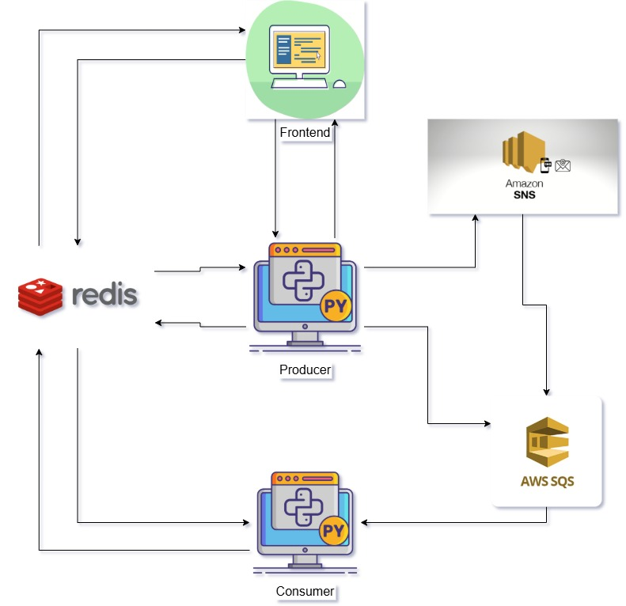
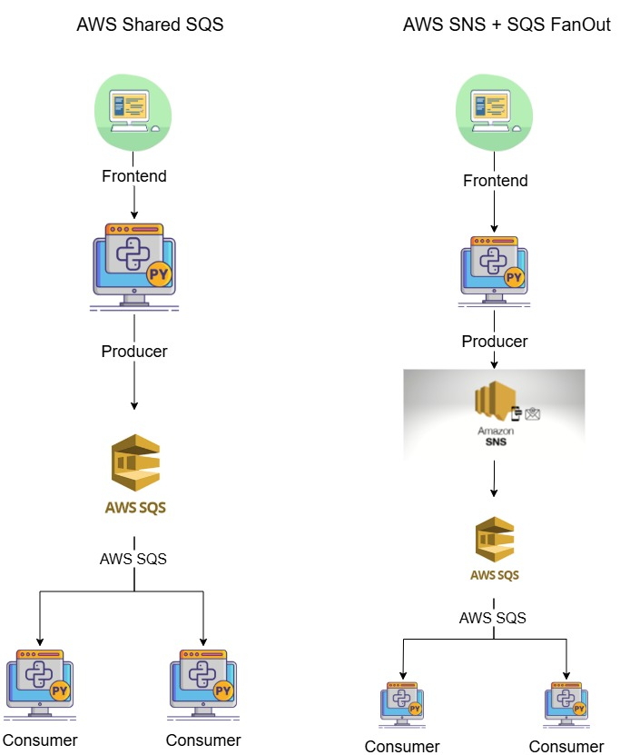

# AWS Shared SQS, AWS SNS + SQS With Signadot integration Demo Project

## 1. Introduction

This project demonstrates a simple application that interacts with Amazon Simple Queue Service (SQS) + Amazon Simple Notification Service (SNS) to SQS fanout pattern, containerized with Docker, and deployed on a local Kubernetes cluster (Minikube). It showcases a basic workflow of setting up cloud credentials, building a container, and deploying it to Kubernetes.

## 2. Project Architecture

Below is the high-level architecture of the project.



## 3. SQS Architecture

The following diagram illustrates the specific AWS Shared SQS, AWS SNS + SQS fanout integration within the application.



## Getting Started

Follow these steps to get the project up and running on your local machine.

### Prerequisites

Make sure you have the following tools installed:
*   [Docker](https://docs.docker.com/get-docker/)
*   [Minikube](https://minikube.sigs.k8s.io/docs/start/)
*   [kubectl](https://kubernetes.io/docs/tasks/tools/install-kubectl/)
*   [AWS CLI](https://docs.aws.amazon.com/cli/latest/userguide/getting-started-install.html)

### Installation Steps

#### 4. Clone the Repository

First, clone this repository to your local machine.

```bash
git clone <YOUR_REPOSITORY_URL>
```

#### 5. Navigate to the Project Directory

Change into the newly cloned project folder.

```bash
cd <PROJECT_FOLDER_NAME>
```

#### 6. Configure AWS Credentials

For the application to communicate with AWS SQS, you need to provide AWS credentials.

1.  Create a new IAM user in your AWS account with programmatic access and `AmazonSQSFullAccess` & `AmazonSNSFullAccess` permissions.
2.  Note down the `Access key ID` and `Secret access key`.
3.  You must base64 encode your credentials.
    ```bash
    echo -n 'YOUR_AWS_ACCESS_KEY_ID' | base64
    echo -n 'YOUR_AWS_SECRET_ACCESS_KEY' | base64
    ```
4.  Open the `k8s/secret.yaml` file and replace the placeholder values for `aws_access_key_id` and `aws_secret_access_key` with your base64-encoded credentials.

    ```yaml
    # k8s/secret.yaml
    apiVersion: v1
    kind: Secret
    metadata:
    name: aws-credentials
    namespace: aws-sqs-app
    type: Opaque
    data:
    AWS_ACCESS_KEY_ID: < YOUR_BASE64_ENCODED_ACCESS_KEY >
    AWS_SECRET_ACCESS_KEY: < YOUR_BASE64_ENCODED_SECRET_KEY >
    ```

#### 7. Build the Docker Image

Before building the image, you need to point your local Docker client to the Docker daemon inside your Minikube cluster.

#### 8. Bind Docker to Minikube

Run the `docker-env` command in your shell. This ensures that when you build the image, it's available within the Minikube cluster without needing a separate image registry.

```bash
# For Linux/macOS
eval $(minikube docker-env)

# For Windows PowerShell
# minikube -p minikube docker-env | Invoke-Expression
```

Now, build the Docker image.

```bash
docker build -t sqs-signadot:latest .
```

#### 9. Create Kubernetes Namespace

Create a dedicated namespace for the project resources.

```bash
kubectl create namespace aws-sqs-app
```

#### 10. Deploy to Kubernetes

Apply all the Kubernetes manifest files located in the `k8s/` directory. This will create the secrets, deployments, services, and other necessary resources.

```bash
kubectl apply -f k8s/
```

## 11. Cleanup

To remove all the project resources from your Minikube cluster, simply delete the namespace.

```bash
kubectl delete namespace ws-sqs-app
```
