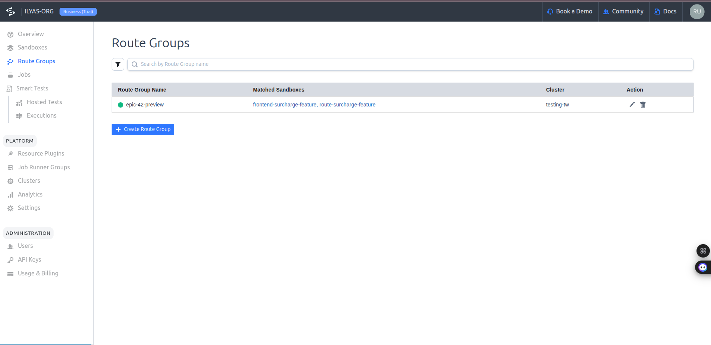

# Tutorial: Collaborative Pre-Merge Testing for Multi-PR Features

When new features span multiple microservices, testing becomes a major challenge. Coordinated changes across separate pull requests (PRs) must be validated together before merging. This tutorial provides a hands-on guide to building an automated system using Signadot that creates unified, ephemeral preview environments for all PRs related to a single feature epic.

This technical guide is a comprehensive, step-by-step resource for:

- Setting up a collaborative pre-merge testing environment with Signadot and HotROD
- Troubleshooting real-world issues
- Automating ephemeral preview environments with GitHub Actions
- Implementing and testing multi-service features such as "Dynamic Surcharges"

> **Note:** The configuration files and code referenced in this guide can be found in the following repository:  
> https://github.com/signadot/examples/tree/main/collaborative-pre-merge-testing-for-multi-PR-features

---

## 1. Prerequisites and Baseline Environment Setup

### 1.2. Deploy the HotROD Demo Application

**Refer to the [HotROD README](https://github.com/signadot/hotrod) for installation steps.**

The HotROD YAMLs will automatically add the necessary annotations for Signadot integration. Follow the installation instructions in the HotROD README file.

```bash
git clone https://github.com/signadot/hotrod.git
cd hotrod
# Follow the installation instructions in the HotROD README
```

### 1.3. Verify the Baseline

Connect to your cluster and access the application:

```bash
signadot local connect --cluster=<your-cluster-name>
```

Then access the frontend using the in-cluster URL: [http://frontend.hotrod.svc:8080](http://frontend.hotrod.svc:8080)

Request a ride by selecting a pickup and dropoff location. A successful request will display a car on a map, confirming the baseline is working.


## 2. The Scenario: Implementing "Dynamic Surcharges"

This scenario demonstrates a real-world example: implementing a "Dynamic Surcharges" feature in the HotROD demo app, which requires changes to both the backend (`route` service) and frontend services. All work for this feature is tracked under the identifier `EPIC-42`.

### 2.1 Backend Change: route Service

Add a new gRPC endpoint to the route service to calculate the surcharge.

**Edit `services/route/route.proto`:**

```proto
// Add these message definitions
message SurchargeRequest {
    string pickup = 1;
    string dropoff = 2;
}

message SurchargeResponse {
  double amount = 1;
}

service RoutesService {
  rpc FindRoute(FindRouteRequest) returns (FindRouteResponse);
  // Add this new RPC
  rpc GetSurcharge(SurchargeRequest) returns (SurchargeResponse);
}
```

**Implement the server logic in `services/route/server.go`:**

```go
// Add this method to the Server struct
func (s *Server) GetSurcharge(ctx context.Context, req *SurchargeRequest) (*SurchargeResponse, error) {
    s.logger.For(ctx).Info("Calculating surcharge", zap.String("pickup", req.Pickup), zap.String("dropoff", req.Dropoff))
    
    // In a real application, you would have logic to determine the surcharge.
    // For this tutorial, we'll return a fixed amount.
    return &SurchargeResponse{
        Amount: 1.25,
    }, nil
}
```

**Add the client method in `services/route/client.go`:**

```go
func (c *Client) GetSurcharge(ctx context.Context, pickup, dropoff string) (*SurchargeResponse, error) {
    c.logger.For(ctx).Info("Getting surcharge", zap.String("pickup", pickup), zap.String("dropoff", dropoff))
    ctx, cancel := context.WithTimeout(ctx, 1*time.Second)
    defer cancel()
    response, err := c.client.GetSurcharge(ctx, &SurchargeRequest{
        Pickup:  pickup,
        Dropoff: dropoff,
    })
    if err != nil {
        return nil, err
    }
    return response, nil
}
```

### 2.2 Frontend Change: frontend Service

Modify the frontend service to call the new `GetSurcharge` endpoint and display the result to the user.

**Update the frontend server in `services/frontend/server.go`:**

```go
// Add import for route client
import route "github.com/signadot/hotrod/services/route"

// Add routeClient field to Server struct
type Server struct {
    // ... existing fields ...
    routeClient *route.Client
}

// Initialize routeClient in NewServer function
func NewServer(options ConfigOptions, logger log.Factory) *Server {
    // ... existing code ...
    routeClient := route.NewClient(tracerProvider, logger, options.RouteHostPort)
    
    return &Server{
        // ... existing fields ...
        routeClient: routeClient,
    }
}

// Add surcharge handler
func (s *Server) surcharge(w http.ResponseWriter, r *http.Request) {
    ctx := r.Context()
    s.logger.For(ctx).Info("HTTP request received", zap.String("method", r.Method), zap.Stringer("url", r.URL))
    
    pickup := r.URL.Query().Get("pickup")
    dropoff := r.URL.Query().Get("dropoff")
    
    if pickup == "" || dropoff == "" {
        http.Error(w, "Missing pickup or dropoff parameters", http.StatusBadRequest)
        return
    }
    
    surchargeRes, err := s.routeClient.GetSurcharge(ctx, pickup, dropoff)
    if err != nil {
        s.logger.For(ctx).Error("Failed to get surcharge", zap.Error(err))
        http.Error(w, "Failed to get surcharge", http.StatusInternalServerError)
        return
    }
    
    s.writeResponse(map[string]interface{}{
        "surcharge": surchargeRes.Amount,
    }, w, r)
}

// Register the surcharge endpoint in createServeMux
func (s *Server) createServeMux() http.Handler {
    mux := http.NewServeMux()
    // ... existing endpoints ...
    mux.HandleFunc("/surcharge", s.surcharge)
    return mux
}

// Update dispatch handler to call surcharge
func (s *Server) dispatch(w http.ResponseWriter, r *http.Request) {
    // ... existing code ...
    
    // Get surcharge before dispatching
    surchargeRes, err := s.routeClient.GetSurcharge(ctx, pickup, dropoff)
    if err != nil {
        s.logger.For(ctx).Error("Failed to get surcharge", zap.Error(err))
        // Continue without surcharge
    }
    
    // ... existing dispatch logic ...
    
    // Pass surcharge to template
    templateData := map[string]interface{}{
        "locations": locations,
        "surcharge": surchargeRes.GetAmount(),
    }
    s.render(r, w, "index", templateData)
}
```

**Update the React frontend in `services/frontend/react_app/src/pages/home.tsx`:**

```tsx
// Add surcharge state
const [surcharge, setSurcharge] = useState<number | null>(null);

// Add getSurcharge function
const getSurcharge = async (pickupId: string, dropoffId: string) => {
    try {
        const response = await fetch(`/surcharge?pickup=${pickupId}&dropoff=${dropoffId}`);
        if (response.ok) {
            const data = await response.json();
            setSurcharge(data.surcharge);
        }
    } catch (error) {
        console.error('Failed to get surcharge:', error);
    }
};

// Update handleRequestDrive to call surcharge
const handleRequestDrive = async () => {
    // ... existing code ...
    await getSurcharge(pickupId, dropoffId);
    // ... rest of the function ...
};

// Add surcharge display in JSX
{surcharge && (
    <Box p={3} bg="yellow.100" borderRadius="md" border="1px solid" borderColor="yellow.300">
        <Text fontWeight="bold" color="yellow.800">
            Dynamic Surcharge Applied: ${surcharge.toFixed(2)}
        </Text>
    </Box>
)}
```

**Update the UI template in `services/frontend/templates/index.html`:**

```html
{{if.surcharge}}
<div class="surcharge-info" style="padding: 10px; background-color: #fffbe6; border: 1px solid #ffe58f; margin-top: 15px; border-radius: 5px;">
    <strong>Dynamic Surcharge Applied:</strong> ${{printf "%.2f".surcharge}}
</div>
{{end}}

<div id="ride-info" class="p-2"></div>
```

### 2.3 Build New Docker Images

**When you create the sandboxes, they need to use a new image - the one that has the code changes for the new feature.**

After making the code changes, build new container images:

```bash
# Generate Go code from proto files
cd hotrod
make generate-proto

# Build the React frontend
make build-frontend-app

# Build the Docker image with all changes
make build-docker

# Tag and push the image
docker tag signadot/hotrod:epic-42-surcharge-only-linux-amd64 <your-dockerhub-username>/hotrod:epic-42-surcharge-only
docker push <your-dockerhub-username>/hotrod:epic-42-surcharge-only
```

---

**Note:** Replace `<your-dockerhub-username>` with your actual Docker Hub username or registry path.

## 3. Manual Workflow: Unified Preview with Signadot

### 3.1. Create Sandboxes for Each Service

Create `route-surcharge-sandbox.yaml`:

```yaml
name: route-surcharge-feature
spec:
  cluster: <your-cluster-name>
  labels:
    epic: EPIC-42
  forks:
    - forkOf:
        kind: Deployment
        namespace: hotrod
        name: route
      customizations:
        images:
          - image: <your-dockerhub-username>/hotrod:epic-42-surcharge-only
```

Create `frontend-surcharge-sandbox.yaml`:

```yaml
name: frontend-surcharge-feature
spec:
  cluster: <your-cluster-name>
  labels:
    epic: EPIC-42
  forks:
    - forkOf:
        kind: Deployment
        namespace: hotrod
        name: frontend
      customizations:
        images:
          - image: <your-dockerhub-username>/hotrod:epic-42-surcharge-only
```

Apply the sandboxes:

```bash
signadot sandbox apply -f route-surcharge-sandbox.yaml --set cluster=<your-cluster-name>
signadot sandbox apply -f frontend-surcharge-sandbox.yaml --set cluster=<your-cluster-name>
```

**Important:** In your cluster, there will be 2 versions of the frontend and route deployments (baseline & sandbox).

### 3.2. Understanding the Testing Use-Case

Before discussing RouteGroups, it's important to understand the testing scenarios we need to cover. In our "Dynamic Surcharges" feature, we have:

- **fe1**: Baseline frontend (original version)
- **fe2**: New frontend with surcharge feature
- **r1**: Baseline route service (original version)
- **r2**: New route service with surcharge API

The following combinations can be tested:

1. **fe1 → r1** (both baseline) - This is just testing the baseline versions to ensure nothing is broken
2. **fe1 → r2** - To ensure changes in r2 haven't broken fe1. Here you can select the sandbox corresponding to r2 and use fe1
3. **fe2 → r1** - This is expected to fail as fe2 depends on new APIs in r2, but you can test whether fe2 handles this gracefully. Here you select the sandbox corresponding to fe2 in the chrome extension
4. **fe2 → r2** - This is where we test the new feature end-to-end and here's where RouteGroups are used as detailed in the next section. RouteGroups combine multiple sandbox contexts into one with its own unique routing key

### 3.3. Create a RouteGroup

Create `epic-routegroup.yaml`:

```yaml
name: epic-42-preview
spec:
  cluster: <your-cluster-name>
  match:
    any:
      - label:
          key: epic
          value: EPIC-42
  endpoints:
    - name: hotrod-frontend
      target: http://frontend.hotrod.svc:8080
```

Apply it:

```bash
signadot routegroup apply -f epic-routegroup.yaml --set cluster=<your-cluster-name>
```

### 3.4. Test the Unified Preview

- Install the [Signadot Chrome Extension](https://chrome.google.com/webstore/detail/signadot/)
- Log in and select the `epic-42-preview` RouteGroup
- Access the application using the RouteGroup URL: `https://hotrod-frontend--epic-42-preview.preview.signadot.com`
- Request a ride; you should see **Dynamic Surcharge Applied: $1.25**


Signadot Dashboard(Cluster)


Signadot Dashboard(Sandboxes)


Signadot Dashboard(Route Group)


---

## 4. Automation: GitHub Actions Integration

### 4.1. Overview

Automate the creation and management of Signadot sandboxes and RouteGroups for every pull request and epic using GitHub Actions. This enables fully automated ephemeral preview environments for collaborative testing.

> **Professional Note:**
> The automation workflows and templates provided here are based on Signadot's official patterns and best practices. They are designed to work when correct parameters, secrets, and valid container images are supplied. However, as with any CI/CD automation, users should validate these workflows in their own environment and adapt as needed for their specific use case and infrastructure.

### 4.2. Add Required GitHub Secrets

In your repository settings, add the following secrets:

- `SIGNADOT_API_KEY` (your Signadot API key)
- `SIGNADOT_ORG` (your Signadot organization name)
- `SIGNADOT_CLUSTER` (your Signadot cluster name)

### 4.3. Workflow 1: Create Sandbox on PR

Create `.github/workflows/create-pr-sandbox.yml`:

```yaml
name: Create PR Sandbox
on:
  pull_request:
    types: [opened, synchronize]

jobs:
  create-sandbox:
    runs-on: ubuntu-latest
    steps:
      - name: Checkout code
        uses: actions/checkout@v4

      - name: Set up Docker Buildx
        uses: docker/setup-buildx-action@v3

      - name: Login to Docker Hub
        uses: docker/login-action@v3
        with:
          username: ${{ secrets.DOCKER_USERNAME }}
          password: ${{ secrets.DOCKER_PASSWORD }}

      - name: Build and push Docker image
        run: |
          cd hotrod
          make build-frontend-app
          make build-docker
          docker tag signadot/hotrod:epic-42-surcharge-only-linux-amd64 <your-dockerhub-username>/hotrod:pr-${{ github.event.pull_request.number }}
          docker push <your-dockerhub-username>/hotrod:pr-${{ github.event.pull_request.number }}

      - name: Install Signadot CLI
        run: curl -sSLf https://raw.githubusercontent.com/signadot/cli/main/scripts/install.sh | sh

      - name: Create Sandbox YAML
        run: |
          cat > temp-sandbox.yaml << EOF
          name: "pr-${{ github.event.pull_request.number }}"
          spec:
            cluster: "${{ secrets.SIGNADOT_CLUSTER }}"
            labels:
              github-pull-request: "${{ github.event.pull_request.number }}"
              github-repo: "${{ github.repository }}"
            forks:
              - forkOf:
                  kind: Deployment
                  namespace: hotrod
                  name: frontend
                customizations:
                  images:
                    - image: "<your-dockerhub-username>/hotrod:pr-${{ github.event.pull_request.number }}"
          EOF

      - name: Apply Sandbox
        env:
          SIGNADOT_API_KEY: ${{ secrets.SIGNADOT_API_KEY }}
          SIGNADOT_ORG: ${{ secrets.SIGNADOT_ORG }}
        run: |
          signadot sandbox apply -f temp-sandbox.yaml
```

### 4.4. Workflow 2: Link Epic via PR Comment

Create `.github/workflows/link-epic-preview.yml`:

```yaml
name: Link Epic Preview
on:
  issue_comment:
    types: [created]

jobs:
  link-epic:
    if: github.event.issue.pull_request && contains(github.event.comment.body, '/epic')
    runs-on: ubuntu-latest
    steps:
      - name: Parse Epic ID from comment
        id: parse_epic
        run: |
          EPIC_ID=$(echo "${{ github.event.comment.body }}" | awk '{print $2}')
          echo "EPIC_ID=${EPIC_ID}" >> $GITHUB_ENV
      - name: Install Signadot CLI
        run: curl -sSLf https://raw.githubusercontent.com/signadot/cli/main/scripts/install.sh | sh

      - name: Create Sandbox YAML with Epic Label
        run: |
          cat > temp-sandbox.yaml << EOF
          name: "pr-${{ github.event.issue.number }}"
          spec:
            cluster: "${{ secrets.SIGNADOT_CLUSTER }}"
            labels:
              epic: "${{ env.EPIC_ID }}"
              github-pull-request: "${{ github.event.issue.number }}"
              github-repo: "${{ github.repository }}"
            forks:
              - forkOf:
                  kind: Deployment
                  namespace: hotrod
                  name: frontend
                customizations:
                  images:
                    - image: "<your-dockerhub-username>/hotrod:pr-${{ github.event.pull_request.number }}"
          EOF
      - name: Update Sandbox with Epic Label
        env:
          SIGNADOT_API_KEY: ${{ secrets.SIGNADOT_API_KEY }}
          SIGNADOT_ORG: ${{ secrets.SIGNADOT_ORG }}
        run: |
          signadot sandbox apply -f temp-sandbox.yaml
      - name: Create RouteGroup YAML
        run: |
          cat > temp-routegroup.yaml << EOF
          name: "epic${{ env.EPIC_ID }}preview"
          spec:
            cluster: "${{ secrets.SIGNADOT_CLUSTER }}"
            match:
              all:
                - label:
                    key: epic
                    value: "${{ env.EPIC_ID }}"
                - label:
                    key: github-pull-request
                    value: "${{ github.event.issue.number }}"
            
          EOF
      - name: Create or Update Epic RouteGroup
        id: routegroup
        env:
          SIGNADOT_API_KEY: ${{ secrets.SIGNADOT_API_KEY }}
          SIGNADOT_ORG: ${{ secrets.SIGNADOT_ORG }}
        run: |
          signadot routegroup apply -f temp-routegroup.yaml
          RG_URL="https://hotrod-frontend--epic${{ env.EPIC_ID }}preview.preview.signadot.com"
          echo "preview_url=${RG_URL}" >> $GITHUB_OUTPUT
      - name: Post Preview URL back to PR
        uses: peter-evans/create-or-update-comment@v4
        with:
          issue-number: ${{ github.event.issue.number }}
          body: |
            ✅ Unified preview for **${{ env.EPIC_ID }}** is ready!
            Preview URL: **${{ steps.routegroup.outputs.preview_url }}** 
```

**Screenshots:**
User commenting /epic EPIC-42 on a PR


GitHub Action workflow running


Preview URL response in PR


### Conclusion

This tutorial demonstrated how to build collaborative pre-merge testing for multi-PR features using Signadot. We successfully implemented a `Dynamic Surcharges` feature across multiple microservices, created isolated sandboxes, unified them through RouteGroups, and established automated workflows.
The approach provides isolated testing environments for each PR while enabling unified preview of integrated features. This methodology scales from manual testing to full automation, making it suitable for teams testing complex, multi-service features in production-like conditions.

---
