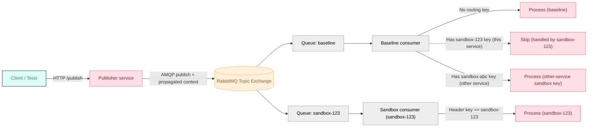
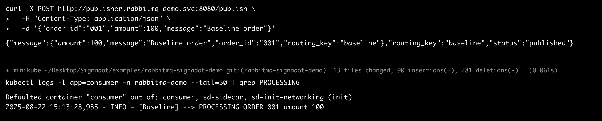
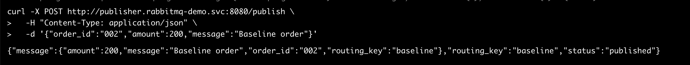
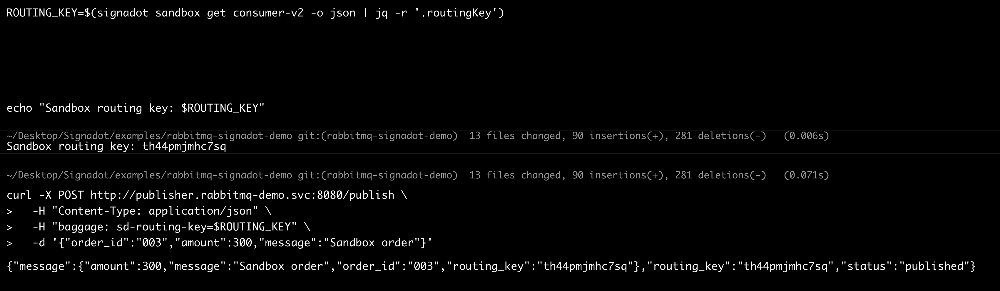
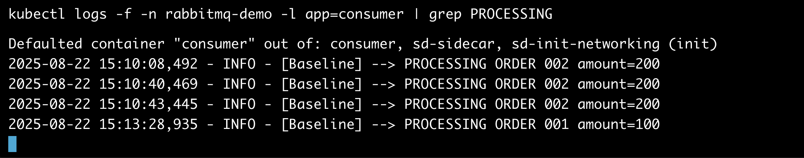
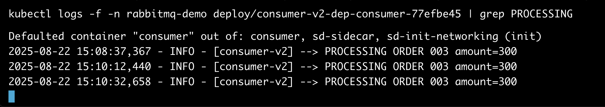

# Testing Microservices with RabbitMQ using Signadot Sandboxes

## Introduction

Asynchronous microservices are hard to test: if two versions of a consumer read from the same queue, they compete for messages. Spinning up a separate broker per branch is slow and pricey.

**Signadot Sandboxes** solve this with **request-level isolation**. Keep a single RabbitMQ, but route messages only to the intended version (sandbox) of your consumer using a **sandbox routing key**. Each sandboxed consumer has its own queue binding; baseline traffic remains untouched while you test safely in parallel.

### What you will accomplish:

- Set up a RabbitMQ-based microservices application
- Use routing keys + selective consumption to isolate sandbox traffic
- Deploy services to Kubernetes
- Create Signadot sandboxes for isolated testing
- Test message routing between baseline and sandbox environments

**Time required:** 45-60 minutes

## Prerequisites

Before starting, ensure you have:

1. **Signadot CLI installed** - Follow the [installation guide](https://www.signadot.com/docs/getting-started/installation)
2. **Docker Desktop** running locally
3. **kubectl** configured to access your Kubernetes cluster
4. **Python 3.8+** and pip
5. **RabbitMQ knowledge** - Basic understanding of exchanges, queues, and routing

## Architecture Overview

- A **topic exchange** fans out each message to **both** baseline and sandbox queues.
- **OTel** propagates the sandbox routing key automatically as W3C **baggage**.
- **Selective consumption** in consumers:
    - **Baseline** consumer processes messages **with no routing key**, and **skips** messages whose key belongs to an **active sandbox of this same service**. It still **processes** messages carrying keys for **other services’ sandboxes** or **inactive/unknown** keys.
    - **Sandbox** consumer processes **only** messages with **its own** sandbox key.

This gives isolation without multiple brokers: everyone receives the message, but only the right consumer acts on it.

### The idea in one picture

Baseline and sandbox consumers each have their own queue bound to the same exchange. Routing keys in headers determine who should act.



## Project structure

```
rabbitmq-signadot-demo/
├── publisher/
│   ├── app.py
│   ├── requirements.txt
│   └── Dockerfile
├── consumer/
│   ├── app.py          
│   ├── requirements.txt
│   └── Dockerfile
├── k8s/
│   ├── namespace.yaml
│   ├── rabbitmq.yaml
│   ├── redis.yaml
│   ├── publisher.yaml
│   └── consumer.yaml 
└── signadot/
    ├── sandboxes/
    │   ├── publisher.yaml
    │   └── consumer.yaml
    └── routegroups/
        └── demo.yaml
```

> You can scaffold this from your own repo or adapt from [Signadot examples](https://github.com/signadot/examples).
> 

## Step 1 – Get the project

Clone the example repository from GitHub:

```bash
git clone https://github.com/signadot/examples/rabbitmq-signadot-demo.git
cd rabbitmq-signadot-demo
```

Inside the repo you’ll find:

- **publisher/** — Flask app with `/publish` and `/events`. Publishes to a topic exchange and logs events to Redis.
- **consumer/** — Python consumer that declares its own queue, binds to the exchange, and processes messages.
- **k8s/** — manifests for RabbitMQ, Redis, publisher, consumer, and a namespace.
- **signadot/** — sandbox specs for publisher/consumer and a **RouteGroup** to bind them under a single routing key.

## Step 2 — Build and push images

```bash
# Publisher
docker build -t YOUR_REGISTRY/rabbitmq-publisher:latest ./publisher
docker push YOUR_REGISTRY/rabbitmq-publisher:latest

# Consumer
docker build -t YOUR_REGISTRY/rabbitmq-consumer:latest ./consumer
docker push YOUR_REGISTRY/rabbitmq-consumer:latest
```

If you’ll test a dev version in a sandbox, also push a `:dev` tag.

---

## Step 2 — Deploy the baseline stack

Create namespace and infra:

```bash
kubectl apply -f k8s/namespace.yaml
kubectl apply -n rabbitmq-demo -f k8s/rabbitmq.yaml
kubectl apply -n rabbitmq-demo -f k8s/redis.yaml

kubectl wait --for=condition=ready pod -l app=rabbitmq -n rabbitmq-demo --timeout=120s
kubectl wait --for=condition=ready pod -l app=redis    -n rabbitmq-demo --timeout=60s
```

Deploy services:

```bash
kubectl apply -n rabbitmq-demo -f k8s/publisher.yaml
kubectl apply -n rabbitmq-demo -f k8s/consumer.yaml
```

Verify pods:

```bash
kubectl get pods -n rabbitmq-demo
```

## Step 3 — Connect to Signadot Locally

Use Signadot Local Connect to reach cluster services directly from your local machine:

```bash
export CLUSTER_NAME=<your_signadot_cluster_name>
signadot local connect --cluster=$CLUSTER_NAME
```

Send a baseline message (no sandbox key):

```bash
curl -X POST http://localhost:8080/publish \
  -H "Content-Type: application/json" \
  -d '{"order_id": "001", "amount": 100, "message": "Baseline order"}'
```

Check:

```bash
kubectl logs -l app=consumer -n rabbitmq-demo --tail=50 | grep PROCESSING
```

You should see baseline processing.



## Step 4 — Create sandboxes and a RouteGroup

Spin up forked workloads for **publisher-v2** and **consumer-v2**:

```bash
export CLUSTER_NAME=<your_registered_cluster>

signadot sandbox apply -f signadot/sandboxes/publisher.yaml --set cluster=$CLUSTER_NAME
signadot sandbox apply -f signadot/sandboxes/consumer.yaml  --set cluster=$CLUSTER_NAME
```

Create a **RouteGroup** that ties them together under one routing key / URL (optional):

```bash
signadot routegroup apply -f signadot/routegroups/demo.yaml --set cluster=$CLUSTER_NAME
signadot routegroup list
```

## Step 5 — Prove isolation

Baseline message (no header → baseline handles it):

```bash
curl -X POST http://publisher.rabbitmq-demo.svc:8080/publish \
  -H "Content-Type: application/json" \
  -d '{"order_id":"002","amount":200,"message":"Baseline order"}'
```



Sandbox message (explicit header → sandbox handles it):

```bash
ROUTING_KEY=$(signadot sandbox get consumer-v2 -o json | jq -r '.routingKey')
echo "Sandbox routing key: $ROUTING_KEY"

curl -X POST http://publisher.rabbitmq-demo.svc:8080/publish \
  -H "Content-Type: application/json" \
  -H "baggage: sd-routing-key=$ROUTING_KEY" \
  -d '{"order_id":"003","amount":300,"message":"Sandbox order"}'
```


Watch logs side-by-side:

- Baseline:

```bash
kubectl logs -f -l app=consumer -n rabbitmq-demo | grep PROCESSING
```



- Sandbox (replace name with your sandbox consumer deployment)

```bash
kubectl logs -f deploy/consumer-v2-dep-consumer-xxxx -n rabbitmq-demo | grep PROCESSING
```



Expected outcome:

- **Baseline** processes **only** messages without a sandbox key or routing key of sandboxes of other services
- **Sandbox** processes **only** messages with its **own** key

## What’s Happening Under the Hood

- **Context propagation:** When you hit a sandbox URL or pass `sd-routing-key`, the **publisher** attaches that key to message **headers**.
- **Fan-out delivery:** RabbitMQ’s **topic exchange** routes messages to **both** baseline and sandbox queues (via their bindings).
- **Selective consumption:**
    - Baseline consumer **accepts** messages **without** a sandbox key; it **skips** messages with a key that belongs to an **active** sandbox.
    - Sandbox consumer processes **only** messages whose `sd-routing-key` equals its **sandbox ID**.
- **No message loss:** Each sandbox has its **own queue** bound to the exchange. Messages always have a target consumer; baseline only “avoids” messages while a matching sandbox is active.

## Conclusion

You’ve built and deployed a minimal RabbitMQ publisher/consumer stack, forked services into Signadot sandboxes, and confirmed that sandbox routing keys isolate messages in a shared RabbitMQ. This approach scales beyond this demo:

- Works with Kafka, Pub/Sub, or SQS (using analogous header/attribute + selective consumption patterns)
- Supports multiple sandboxes concurrently (e.g., per PR)
- Integrates naturally with CI/CD to spin up ephemeral test envs for each change

For deeper dives, see:

- [Signadot docs](https://www.signadot.com/docs/overview)
- [Example source](https://github.com/signadot/examples/tree/main)

Happy testing!